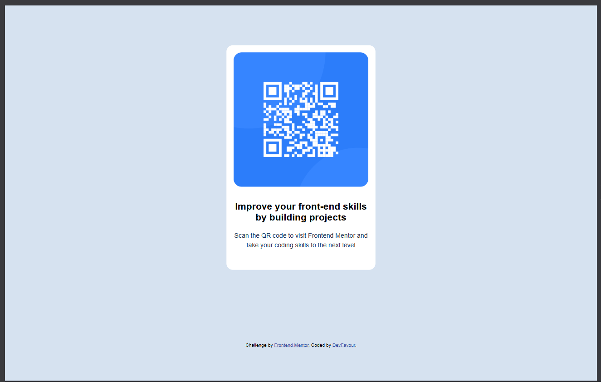
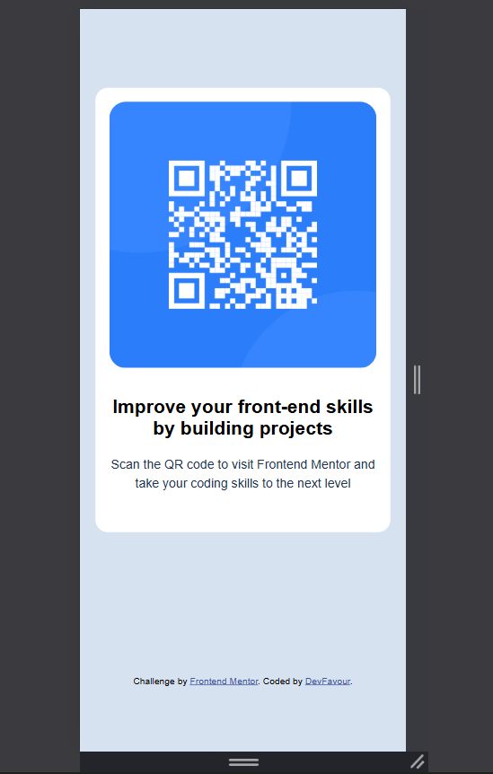

# Frontend Mentor - QR code component solution

This is a solution to the [QR code component challenge on Frontend Mentor](https://www.frontendmentor.io/challenges/qr-code-component-iux_sIO_H). Frontend Mentor challenges help you improve your coding skills by building realistic projects. 

## Table of contents

- [Overview](#overview)
  - [Screenshot](#screenshot)
  - [Links](#links)
- [My process](#my-process)
  - [Built with](#built-with)
  - [What I learned](#what-i-learned)
- [Author](#author)

## Overview

### Screenshot

### Links

- Solution URL: [Add solution URL here](https://your-solution-url.com)
- Live Site URL: [Add live site URL here](https://your-live-site-url.com)

## My process
- Built the HTML Structure: Visualized everything into boxes
- Styled each container using CSS: Used Grid as the main alignment layout to avoid using margin for alignment

### Built with

- Semantic HTML5 markup
- CSS custom properties
- CSS Grid
- Mobile-first workflow

### What I learned
- CSS code i'm going to be using for my projects: Macro grid layout:
- body{
    background-color: var(--Slate-300);
    font-family: "Outfit", sans-serif;
    font-size: 15px;
    display: grid;
    place-items: center;
    height: 100vh;
}
- using this turns margin & padding from creating alignments to creating breathing space for elements and it makes mobile responsivenss easier

### Continued development
-When to use Grid as the main alignment structure of a website

## Author

- Website - [DevFavour](https://www.your-site.com)
- Frontend Mentor - [@yourusername](https://www.frontendmentor.io/profile/yourusername)
- Twitter - [@yourusername](https://www.twitter.com/yourusername)
