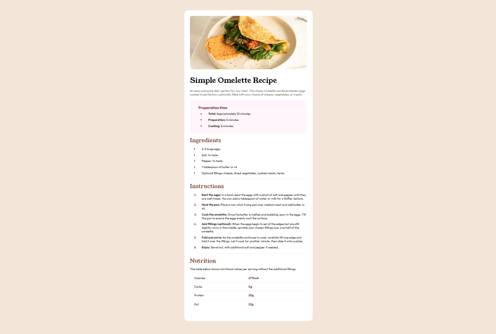
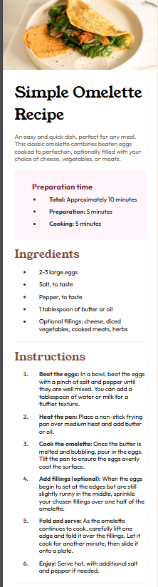

# Frontend Mentor - Recipe page solution

This is a solution to the [Recipe page challenge on Frontend Mentor](https://www.frontendmentor.io/challenges/recipe-page-KiTsR8QQKm). Frontend Mentor challenges help you improve your coding skills by building realistic projects. 

## Table of contents

- [Overview](#overview)
  - [The challenge](#the-challenge)
  - [Screenshot](#screenshot)
  - [Links](#links)
- [My process](#my-process)
  - [Built with](#built-with)
  - [What I learned](#what-i-learned)
- [Author](#author)
- [Acknowledgments](#acknowledgments)

## Overview
- Users should be able to see a recipe page with a list of ingredients and instructions.
### Screenshot

### Links

- Live Site URL: https://main-recipe-page.vercel.app/ 

## My process

### Built with

- Semantic HTML5 markup
- CSS custom properties
- Flexbox
- CSS Grid
- Mobile-first workflow

### What I learned
- I learnt about tables and how to use them to display data and style themin a structured way.

### Continued development
- Semantic HTML5 markup and applying BEM-naming

## Author

- Website - [DevFavour]
- Frontend Mentor - [@yourusername](https://www.frontendmentor.io/profile/yourusername)
- Twitter - [@yourusername](https://www.twitter.com/yourusername)

**Note: Delete this note and add/remove/edit lines above based on what links you'd like to share.**

## Acknowledgments
Great thanks to [CodingWithJiro](https://www.frontendmentor.io/profile/CodingWithJiro) for the inspiration and guidancein completing this challenge.
