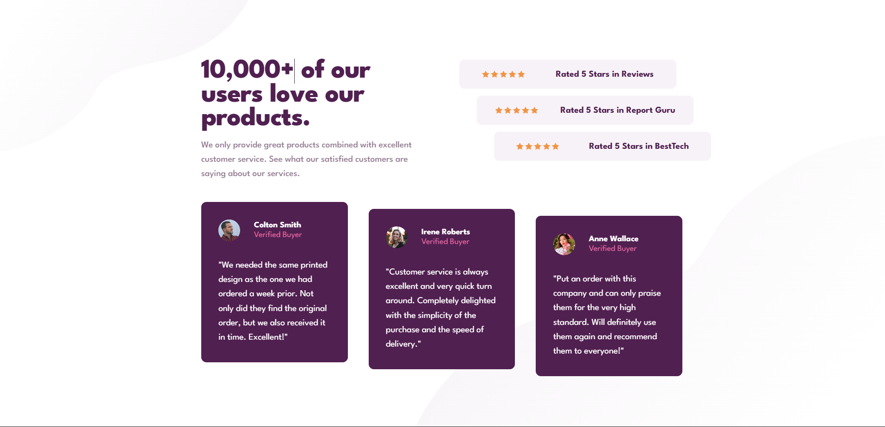

# Frontend Mentor - Social proof section solution

This is a solution to the [Social proof section challenge on Frontend Mentor](https://www.frontendmentor.io/challenges/social-proof-section-6e0qTv_bA). Frontend Mentor challenges help you improve your coding skills by building realistic projects. 

## Table of contents

- [Overview](#overview)
  - [The challenge](#the-challenge)
  - [Screenshot](#screenshot)
  - [Links](#links)
- [My process](#my-process)
  - [Built with](#built-with)
  - [What I learned](#what-i-learned)

## Overview

### The challenge

Users should be able to:

- View the optimal layout for the section depending on their device's screen size

### Screenshot

### Links

- Solution URL: [Add solution URL here](https://your-solution-url.com)
- Live Site URL: https://social-testimonial-proof-card.vercel.app/

## My process

### Built with

- Semantic HTML5 markup
- CSS custom properties
- Flexbox
- CSS Grid
- Mobile-first workflow

### What I learned
- Transform property in CSS can be used to scale,rotate,move and skew elements. It is a shorthand property for transform functions. Translate y (translateY) is used to move an element along the y-axis. It can be used to move an element up or down from its current position. The value can be in pixels, percentages, or other units. For example, `transform: translateY(-50px);` will move the element 50 pixels up from its current position.
- How to create multiple background images in CSS using the `background-image` property. You can specify multiple images by separating them with commas. For example, `background-image: url('image1.jpg'), url('image2.jpg');` will apply both images as backgrounds to the element.
- How to duplicate a background image in CSS using the `background-repeat` property. You can set it to `repeat`, `repeat-x`, `repeat-y`, or `no-repeat` to control how the background image is repeated. For example, `background-repeat: repeat;` will repeat the background image both horizontally and vertically.
