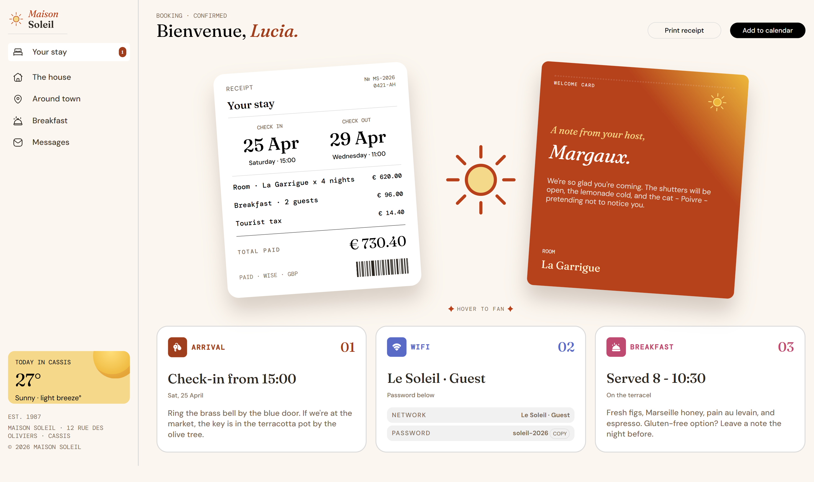
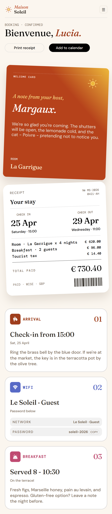

# Frontend Mentor - Hotel booking confirmation page solution

This is a solution to the [Hotel booking confirmation page challenge on Frontend Mentor](https://www.frontendmentor.io/challenges/hotel-booking-confirmation-page). Frontend Mentor challenges help you improve your coding skills by building realistic projects. 

## Table of contents

- [Overview](#overview)
  - [The challenge](#the-challenge)
  - [Screenshot](#screenshot)
  - [Links](#links)
- [My process](#my-process)
  - [Built with](#built-with)
  - [What I learned](#what-i-learned)
  - [Continued development](#continued-development)

## Overview

### The challenge

Users should be able to:

- View the optimal layout for the interface depending on their device's screen size ✅
- See hover and focus states for all interactive elements on the page ✅
- Open and close the navigation menu on smaller screens (optional JavaScript)
- Copy the Wi-Fi password to their clipboard using the copy button (optional JavaScript)

### Screenshot

### Links

- Solution URL: [Add solution URL here](https://your-solution-url.com)
- Live Site URL: [Add live site URL here](https://your-live-site-url.com)

## My process

### Built with

- Semantic HTML5 markup
- CSS custom properties
- Flexbox
- CSS Grid
- Mobile-first workflow

### What I learned
- i learnt about how to use translate property in css to move the element from one place to another,rotate property to rotate the element in a particular angle.
- i learnt about the importance of scaling your website for different screen sizes.

## Author

- Website - [Add your name here](https://www.your-site.com)
- Frontend Mentor - [@yourusername](https://www.frontendmentor.io/profile/yourusername)
- Twitter - [@yourusername](https://www.twitter.com/yourusername)

